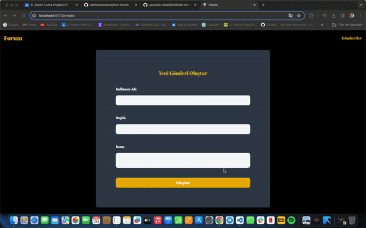

# Kütüphaneler

- axios
- json-server
- react-router-dom
- tailwind

# MVC (Model - View - Controller)

- Model:

* Uygulamanın veri mantığını ve yapısını temsil eder.

  Örn:

* Bileşende tutulacak state'in başlangıç değeri
* Veriyi formatlamaya yarayan fonksiyon
* Api istekleri tutulabilir
* Genellikle Class yapısı ile tanımlanır.

- View:

* Son kullanıcının gördüğü tasarımdır.
* Bileşenin return satırında yazdığımız jsx elementleri burada tanımlanır.

- Controller:

* View ile model arasındaki bağlantıyı sağlar
* Kullanıcı etkileşimiyle tetiklenecek bütün fonksiyonlar burada tanımlanır.

# MVC Klasör Yapısı

## 1.yol

- public
- src
- - pages
- - - MainPage
- - - - MainPageController
- - - - MainPageView
- - - - MainPageModel

- - - AuthPage
- - - - AuthPageController
- - - - AuthPageView
- - - - AuthPageModel

## 2.yol

- public
- src
- - controllers
- - - MainPageController
- - - AuthPageController

- - models
- - - MainPageModel
- - - AuthPageModel

- - views
- - - MainPageView
- - - AuthPageView

# mvc-forum

Heyecanla duyurmak istediğim bir haberim var! React ve MVC yapısıyla geliştirdiğimiz yeni forum uygulamamızla karşınızdayız! Bu uygulama, kullanıcıların çeşitli konularda fikir alışverişinde bulunabileceği, etkileşimde bulunabileceği ve yeni şeyler öğrenebileceği bir platform sunuyor.

➡️ Başlık ve Konu Çeşitliliği: Kullanıcılar istedikleri konular altında başlık açabilir ve bu başlıklar altında fikirlerini, deneyimlerini paylaşabilirler. Spor, teknoloji, sanat, iş dünyası ve daha fazlası - sadece hayal gücünüzle sınırlı!

➡️ Etkileşim ve İlham: Forumumuzda diğer kullanıcılarla etkileşime geçin, sorular sorun, cevaplar alın ve yeni bakış açıları keşfedin. Belki de hiç düşünmediğiniz bir konuda ilham verici bir tartışma başlatırsınız!

➡️ API Desteği: Axios ile güçlendirilmiş API istekleri sayesinde, uygulamamız hızlı ve güvenilir. Kendi API'mizi JSON Server ile oluşturduk ve size en güncel ve kesintisiz deneyimi sunuyoruz.

➡️ Kolay Kullanım: React Router DOM ile sayfalama yapısı ve Tailwind CSS ile sağlanan responsive tasarım, forumumuzu her cihazda kullanıcı dostu hale getiriyor. Hem masaüstü hem de mobil cihazlarda mükemmel bir deneyim için tasarlandı.

# screenshot

